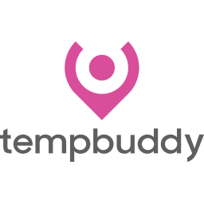
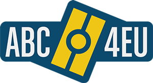

# Portfolio
___

Here you could find some of the projects where I have worked and collaborated.

## TempBuddy
My main task is to develop  and maintain the [Android app](https://play.google.com/store/apps/details?id=com.tempbuddy.tempbuddy) of TempBuddy and the rest of investing clients. I also participate in the development and maintain of the [web portal](https://eu.tempbuddy.com/) as fullstack y QA member.

 

## ABC4EU
  I developed an Android application for devices used by border guards to control travelers and verify their electronic documents and their status in the country. The application can read documents (MRZ) and chip reading (RFID) as well as biometric readings (fingerprint, facial recognition, etc.). To do this I integrated the SDK provided by the company [Coppernic](https://www.coppernic.fr/). The app is not for public use but you can [see videos](https://www.youtube.com/channel/UCp4Cfh2A7q5EEa8yK7xQrJw) for demonstration on Youtube.
  

 

## Other proyects
  Contact me to see private projects.

[Back](./)
