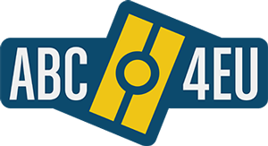

# Portafolio
___

Aqui podrás encontrar algunos de los trabajos que he realizado o en los que he colaborado.

## TempBuddy
Mi tarea principal es la gestión de la app de TempBuddy y clientes. Mira [aplicación Android](https://play.google.com/store/apps/details?id=com.tempbuddy.tempbuddy) o [TempBuddy iOS app](https://apps.apple.com/es/app/tempbuddy/id905008100) para más detalles. También participo en el desarrollo y mantenimiento del [portal web](https://eu.tempbuddy.com/) como fullstack y miembro de QA.

 

## ABC4EU
  Desarrollé una aplicación Android para dispositivos usados por los guardias de fronteras para el control de viajeros y verificación de sus documentos electrónicos y su estado en el país. La aplicación es capaz de leer documentos (MRZ) y lectura de chip (RFID) así como lecturas biométricas (huella dactilar, reconocimiento facial, etc.). Para hacer esto integré el SDK proporcionado por la compañia [Coppernic](https://www.coppernic.fr/). La app no es de uso público pero puede [ver vídeos](https://www.youtube.com/channel/UCp4Cfh2A7q5EEa8yK7xQrJw) de demostración en Youtube.
  

 

## Otros proyectos
  Consúltame para ver proyectos privados.

[Volver](./)
